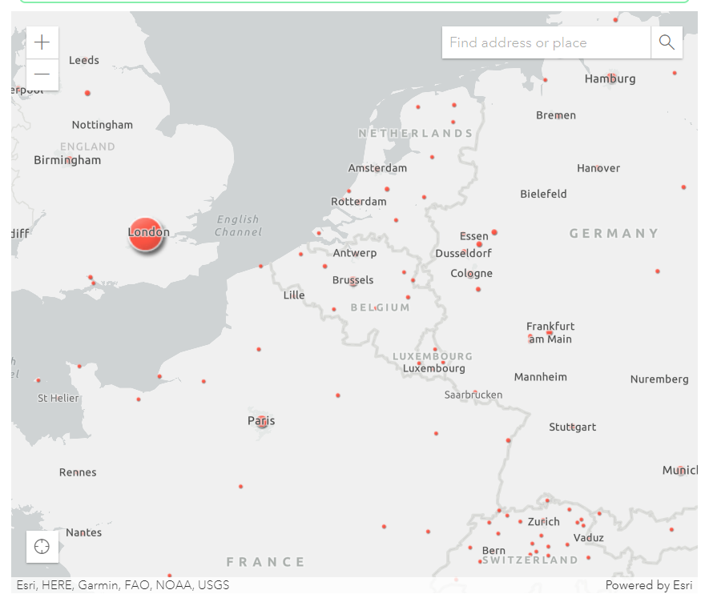
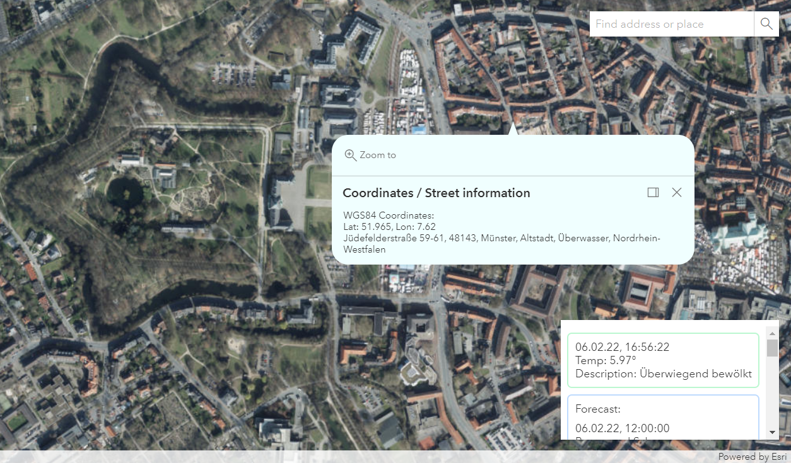

# Introduction

Basic weather-app with additional geo map support by [ESRI API](https://www.esri.com/). 
Additional information are included by [OpenWeather](https://openweathermap.org/) and [Google Maps Platform](https://developers.google.com/maps) 

##  basic fullstack project

This project uses [Next.js](https://nextjs.org/) as simple and performant backend with [Prisma](https://www.prisma.io/) as ORM.
[React](https://reactjs.org/) is being used as Frontend framework with [Tailwind css](https://tailwindcss.com/) for creating fast and clean user interfaces.  
For automated tests [Cypress](https://docs.cypress.io) is used as end-to-end test framework.  

## Screenshots

## Getting started

Just use <code>npm install</code> and you are ready to go :)

Edit <code>*_API_KEY</code> - Files in <code>.env</code> or create a <code>.env.local</code> and assure that is set to your <code>.gitignore</code>.  

Open [http://localhost:3000](http://localhost:3000) with your browser to see your current page.

## Test automation

Run <code>npx cypress open</code> and choose <code>basic-test.spec.js</code>.

See your test running in a real browser :)

## Build project

Run <code>npm run build</code> to start the NextJS Build Process. The build is stored regularly in <code>weather-app/.next</code>

## Author

<b>Artur Marks</b>